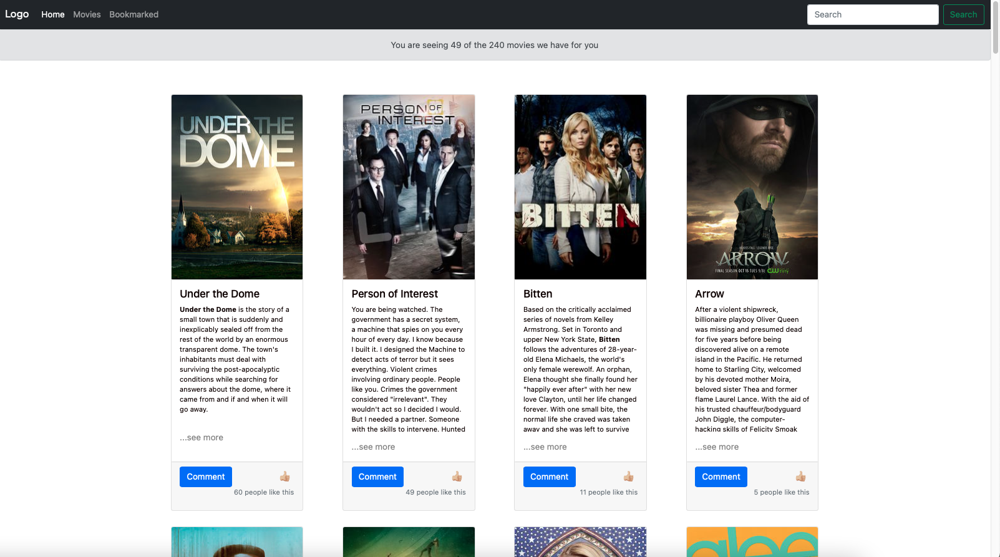

# Movies revies Captones
> This page allows you to see the reviews of different films that we get from an API, you can like or comment the movies if you like them or not.

# Screenshots

## Built With
- html
- sass
- bootstrap
- javaScript
- Webpack

## Live Demo
You can see my page live here: 
[Check it out!](https://bimbolabuari.github.io/mv-JavaScript-capstone/)

## Getting Started
To get a local copy run the following steps
- clone this repo
- `npm install` to install the packages
- `npm install @popperjs/core --save` to use the bootstrap features
- `npm run start` to build dist files and run local server

## Authors

👤 *Diego Solis*

- GitHub: [@disc3110](https://github.com/disc3110)

👤 *Abimbola Buari*

- GitHub: [@bimbolabuari](https://github.com/bimbolabuari)

## 🤝 Contributing

Contributions, issues, and feature requests are welcome!

<!--Feel free to check the [issues page](../../issues/).-->

## Show your support

Give a ⭐️ if you like this project!

<!--## Acknowledgments-->

## 📝 License

This project is [MIT](./MIT.md) licensed.
